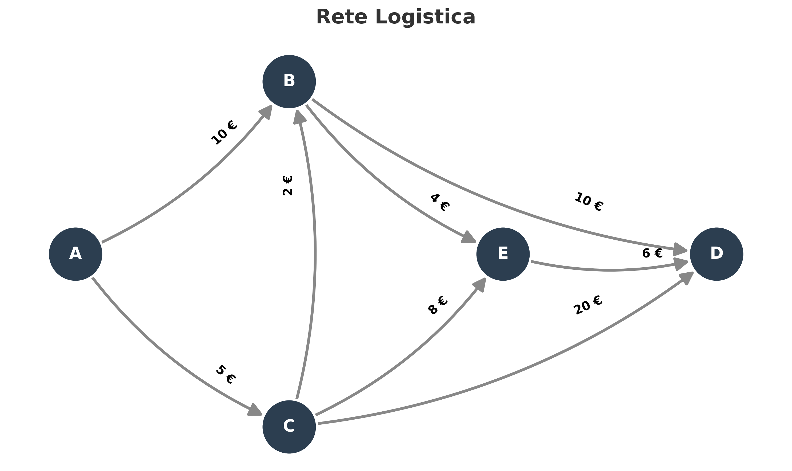

# Logistics Optimization

Una pipeline logistica in Python che integra **Data Quality**, **Graph Theory** e **Ricerca Operativa** per risolvere un classico problema di ottimizzazione su rete (Shortest Path / Min-Cost Flow).

## 🛠️ Architettura e Stack Tecnologico
Il progetto è strutturato in tre fasi modulari:

1. 🛡️ **Fase 1: Data Validation (Pydantic)**
   I dati grezzi vengono simulati come se arrivassero da un’API esterna e vengono validati prima di entrare nella pipeline. Pydantic gestisce la tipizzazione e applica vincoli di business rigorosi, come la positività del costo di ogni rotta, impedendo che valori non validi raggiungano il modello di ottimizzazione.

2. 🕸️ **Fase 2: Graph Modeling (NetworkX)**
   Una volta validati, i dati vengono trasformati in un grafo pesato e direzionato (Weighted DiGraph). Questa rappresentazione consente di modellare la rete logistica, analizzarne la struttura topologica e visualizzare le connessioni tra i nodi.

3. 🧮 **Fase 3: Mathematical Optimization (Pyomo)**
   Il grafo viene infine tradotto in un modello matematico orientato all’ottimizzazione. Con Pyomo vengono definiti la funzione obiettivo, che minimizza il costo totale di trasporto, e i vincoli di conservazione del flusso sui nodi. Il modello viene risolto tramite un solver lineare open-source (GLPK) per ottenere il percorso ottimale.

## 📊 Visualizzazione della Rete Topologica
*(Il codice salva automaticamente questa mappa come file PNG nella root del progetto)*



## 🚀 Come eseguire il progetto in locale

1. **Clona il repository e installa le dipendenze Python:**
   ```bash
   git clone https://github.com/Domenicos97/LogisticsOptimization.git
   cd LogisticsOptimization
   pip install -r requirements.txt
   ```

2. **Installa il Solver (GLPK):**
   Per permettere a Pyomo di eseguire l'ottimizzazione matematica, è necessario un solver esterno installato nel sistema operativo.
   * **Ubuntu/Debian:** `sudo apt-get install glpk-utils`
   * **macOS:** `brew install glpk`
   * **Windows:** Scarica i binari dal sito ufficiale o usa un package manager come Conda (assicurati di aggiungere l'eseguibile al `PATH` di sistema).

3. **Avvia la pipeline:**
   ```bash
   python main.py
   ```
